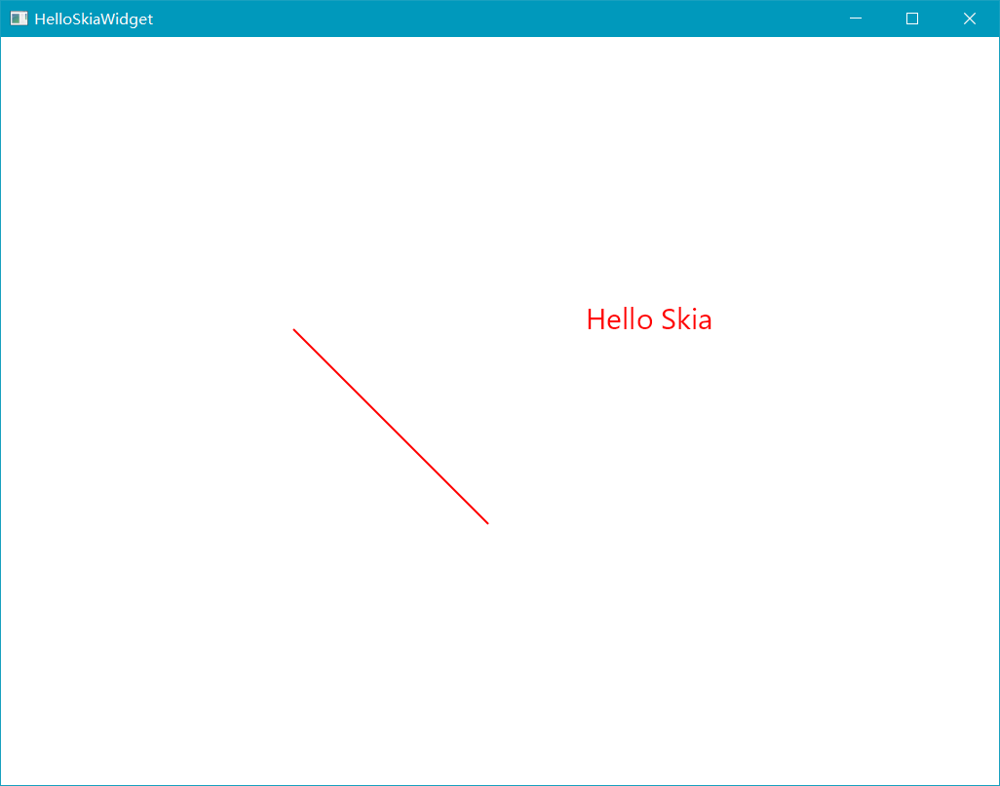
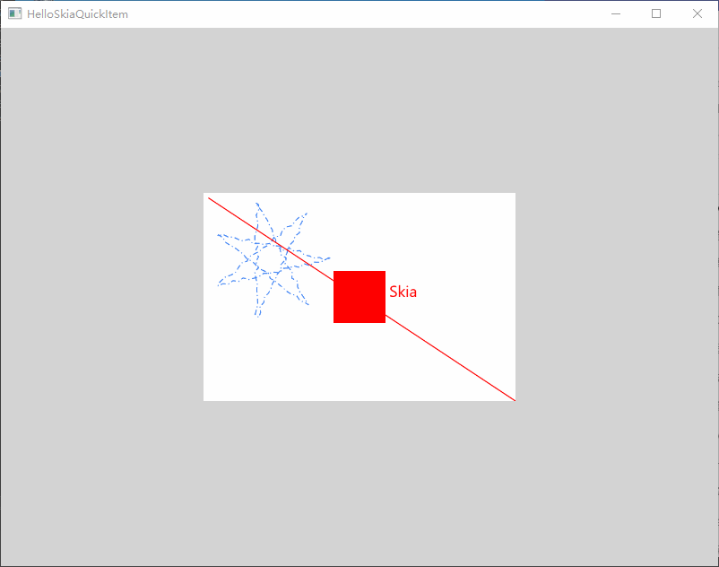

# QtSkia使用示例

QtSkia处理了skia与QWidget、QOpenGLWindow、QQuick等渲染框架的融合问题，并将SkCanvas在接口中提供出来。

开发者只要重写父类虚函数，使用SkCanvas执行绘制操作即可。

SkCanvas是一个类似于QPainter的画笔，但性能和功能都比QPainter强大许多。

## QWidget使用skia

继承QSkiaWidget类并重写draw函数即可。

```c++
//main.cpp
#pragma once
#include <QApplication>
#include "QSkiaWidget.h"

class SkiaWidget : public QSkiaWidget {
    Q_OBJECT
public:
    void draw(SkCanvas *canvas) override
    {
        SkPaint p;
        p.setAntiAlias(true);
        p.setColor(SK_ColorRED);
        p.setStrokeWidth(2.0f);

        SkFont font;
        font.setSize(30);

        canvas->clear(SK_ColorWHITE);

        canvas->drawString("Hello Skia", 600, 300, font, p);
        canvas->drawLine(300, 300, 500, 500, p);
        canvas->flush();
    }
};

int main(int argc, char* argv[])
{
    QApplication app(argc, argv);

    SkiaWidget win;
    win.resize(1024, 768);
    win.show();
    return app.exec();
}

```

效果如图：



注意:

开发者要在draw开始处调用一次canvas->clear。

在draw结束时调用一次canvas->flush。

## QWidget 使用 OpenGL skia

QWidget本身是CPU光栅化渲染的，适合在一些无GPU的设备中运行。

如果设备支持OpenGL，也可以在QWidget中集成OpenGL, 实现GPU硬件加速。

只要继承QSkiaOpenGLWidget类即可：

```C++
class SkiaGLWidget : public QSkiaOpenGLWidget {
    Q_OBJECT
public:
    void draw(SkCanvas *canvas) override
    {
        SkPaint p;
        p.setAntiAlias(true);
        p.setColor(SK_ColorRED);
        p.setStrokeWidth(2.0f);

        SkFont font;
        font.setSize(30);

        canvas->clear(SK_ColorWHITE);

        canvas->drawString("Hello Skia", 600, 300, font, p);
        canvas->drawLine(300, 300, 500, 500, p);

        canvas->flush();
    }
};
```
## 纯OpenGL窗口 + skia

QtSkia还提供了纯粹的OpenGL窗口，仅依赖Qt GUI模块，可以实现全部UI由OpenGL渲染。

下面代码示例, 在纯OpenGL窗口中，绘制星形路径特效

```C++
#pragma once
#include "QSkiaOpenGLWindow.h"
#include "core/SkCanvas.h"
#include "core/SkPaint.h"
#include "effects/SkDashPathEffect.h"
#include "effects/SkDiscretePathEffect.h"

//生成星形路径
static SkPath star()
{
    const SkScalar R = 115.2f, C = 128.0f;
    SkPath path;
    path.moveTo(C + R, C);
    for (int i = 1; i < 8; ++i) {
        SkScalar a = 2.6927937f * i;
        path.lineTo(C + R * cos(a), C + R * sin(a));
    }
    return path;
}
class SkiaGLWindow : public QSkiaOpenGLWindow {
    Q_OBJECT
public:
    virtual void onInit(int w, int h) override
    {
        const SkScalar intervals[] = { 10.0f, 5.0f, 2.0f, 5.0f };
        size_t count = sizeof(intervals) / sizeof(intervals[0]);
        m_effect = SkPathEffect::MakeCompose(
            SkDashPathEffect::Make(intervals, count, 0.0f),
            SkDiscretePathEffect::Make(10.0f, 4.0f));
        m_path = star();

        m_paint.setPathEffect(m_effect);
        m_paint.setStyle(SkPaint::kStroke_Style);
        m_paint.setStrokeWidth(2.0f);
        m_paint.setAntiAlias(true);
        m_paint.setColor(0xff4285F4);
    }
    virtual void onResize(int w, int h) override {}
    virtual void draw(SkCanvas* canvas, int elapsed) override
    {
        canvas->clear(SK_ColorWHITE);

        canvas->drawPath(m_path, m_paint);

        canvas->flush();
    }

private:
    SkPaint m_paint;
    SkPath m_path;
    sk_sp<SkPathEffect> m_effect = nullptr;
};

```
效果如下:


## QtQuickWindow 使用 skia

继承于QSkiaQuickWindow,可以在整个Qml场景中添加Skia渲染。

```C++
static SkPath star()
{
    const SkScalar R = 115.2f, C = 128.0f;
    SkPath path;
    path.moveTo(C + R, C);
    for (int i = 1; i < 8; ++i) {
        SkScalar a = 2.6927937f * i;
        path.lineTo(C + R * cos(a), C + R * sin(a));
    }
    return path;
}

class SkiaQuickWindow : public QSkiaQuickWindow {
    Q_OBJECT
public:
    virtual void onInit(int w, int h) override
    {
        const SkScalar intervals[] = { 10.0f, 5.0f, 2.0f, 5.0f };
        size_t count = sizeof(intervals) / sizeof(intervals[0]);
        m_effect = SkPathEffect::MakeCompose(
            SkDashPathEffect::Make(intervals, count, 0.0f),
            SkDiscretePathEffect::Make(10.0f, 4.0f));
        m_path = star();

        m_paint.setPathEffect(m_effect);
        m_paint.setStyle(SkPaint::kStroke_Style);
        m_paint.setStrokeWidth(2.0f);
        m_paint.setAntiAlias(true);
        m_paint.setColor(0xff4285F4);
    }
    virtual void onResize(int w, int h) override {}

    virtual void drawBeforeSG(SkCanvas* canvas, int elapsed) override
    {
        int w = this->width();
        int h = this->height();
        m_rotateAngle = int(elapsed * m_rotateSpeed + m_rotateAngle) % 360;

        SkPaint p;
        p.setAntiAlias(true);
        p.setColor(SK_ColorRED);
        p.setStrokeWidth(2.0f);
        SkFont font;
        font.setSize(30);
        canvas->clear(SK_ColorWHITE);

        canvas->rotate(m_rotateAngle, w / 2, h / 2);
        canvas->drawString("Hello Skia", w / 2 - 20, h / 2, font, p);
        canvas->drawLine(w * 0.2f, h * 0.2f, w * 0.4f, h * 0.4f, p);

        canvas->flush();
    }
    virtual void drawAfterSG(SkCanvas* canvas, int elapsed) override
    {
        //don't clear here.
        int w = this->width();
        int h = this->height();
        canvas->rotate(m_rotateAngle, w / 2, h / 2);
        canvas->drawPath(m_path, m_paint);
        canvas->flush();
    }

private:
    SkPaint m_paint;
    SkPath m_path;
    sk_sp<SkPathEffect> m_effect = nullptr;
    float m_rotateSpeed = 90.0f / 1000;
    int m_rotateAngle = 0;
};

```

效果如下：


其中文字和红色的线，在Qml场景渲染之前先渲染，星形路径在Qml场景之后渲染。

## QtQuickItem use skia

继承 QSkiaQuickItem, 就可以在任意Qml Item中渲染了。

```C++
static SkPath star()
{
    const SkScalar R = 115.2f, C = 128.0f;
    SkPath path;
    path.moveTo(C + R, C);
    for (int i = 1; i < 8; ++i) {
        SkScalar a = 2.6927937f * i;
        path.lineTo(C + R * cos(a), C + R * sin(a));
    }
    return path;
}

class SkiaQuickItem : public QSkiaQuickItem {
    Q_OBJECT
public:
    virtual void onInit(int w, int h) override
    {
        const SkScalar intervals[] = { 10.0f, 5.0f, 2.0f, 5.0f };
        size_t count = sizeof(intervals) / sizeof(intervals[0]);
        m_effect = SkPathEffect::MakeCompose(
            SkDashPathEffect::Make(intervals, count, 0.0f),
            SkDiscretePathEffect::Make(10.0f, 4.0f));
        m_path = star();

        m_starPaint.setPathEffect(m_effect);
        m_starPaint.setStyle(SkPaint::kStroke_Style);
        m_starPaint.setStrokeWidth(2.0f);
        m_starPaint.setAntiAlias(true);
        m_starPaint.setColor(0xff4285F4);

        m_linePaint.setAntiAlias(true);
        m_linePaint.setStrokeWidth(2.0f);
        m_linePaint.setColor(SK_ColorRED);

        m_font.setSize(30);
    }
    virtual void onResize(int w, int h) override {}
    virtual void draw(SkCanvas* canvas, int elapsed) override
    {
        auto size = this->size().toSize();
        int w = size.width();
        int h = size.height();
        m_rotateAngle = int(elapsed * m_rotateSpeed + m_rotateAngle) % 360;

        canvas->clear(SK_ColorWHITE);
        canvas->drawPath(m_path, m_starPaint);

        canvas->drawString("Hello Skia", w / 2 - 20, h / 2, m_font, m_linePaint);
        canvas->drawLine(10, 10, w, h, m_linePaint);
        canvas->flush();
    }
private:
    SkPaint m_starPaint;
    SkPaint m_linePaint;
    SkFont m_font;
    SkPath m_path;
    sk_sp<SkPathEffect> m_effect = nullptr;
    float m_rotateSpeed = 90.0f / 1000;
    int m_rotateAngle = 0;
};

```
注册Item到Qml:

```C++
    qmlRegisterType<SkiaQuickItem>("SkiaQuickItem", 1, 0, "SkiaQuickItem");
```

Qml代码如下：

```Qml
import QtQuick 2.0
import QtQuick.Controls 2.0
import SkiaQuickItem 1.0
Rectangle {
    width: 800
    height: 600
    color: "lightgray"
    SkiaQuickItem {
        id: renderer
        width: 600
        height: 400
        anchors.centerIn: parent
        Rectangle {
            width: 100
            height: 100
            anchors.centerIn: parent
            color: "red"
        }
        transform: [
            Rotation { id: rotation; axis.x: 0; axis.z: 0; axis.y: 1; angle: 0; origin.x: renderer.width / 2; origin.y: renderer.height / 2; },
            Translate { id: txOut; x: -renderer.width / 2; y: -renderer.height / 2 },
            Scale { id: scale; },
            Translate { id: txIn; x: renderer.width / 2; y: renderer.height / 2 }
        ]
    }
    SequentialAnimation {
        ParallelAnimation {
            NumberAnimation { target: scale; property: "xScale"; to: 0.6; duration: 1000; easing.type: Easing.InOutBack }
            NumberAnimation { target: scale; property: "yScale"; to: 0.6; duration: 1000; easing.type: Easing.InOutBack }
        }
        NumberAnimation { target: rotation; property: "angle"; to: 80; duration: 1000; easing.type: Easing.InOutCubic }
        NumberAnimation { target: rotation; property: "angle"; to: -80; duration: 1000; easing.type: Easing.InOutCubic }
        NumberAnimation { target: rotation; property: "angle"; to: 0; duration: 1000; easing.type: Easing.InOutCubic }
        NumberAnimation { target: renderer; property: "opacity"; to: 0.1; duration: 1000; easing.type: Easing.InOutCubic }
        PauseAnimation { duration: 1000 }
        NumberAnimation { target: renderer; property: "opacity"; to: 1.0; duration: 1000; easing.type: Easing.InOutCubic }
        ParallelAnimation {
            NumberAnimation { target: scale; property: "xScale"; to: 1; duration: 1000; easing.type: Easing.InOutBack }
            NumberAnimation { target: scale; property: "yScale"; to: 1; duration: 1000; easing.type: Easing.InOutBack }
        }
        running: true
        loops: Animation.Infinite
    }
}
```
效果如下: 

